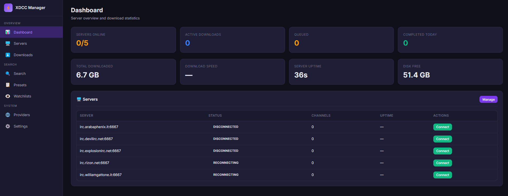
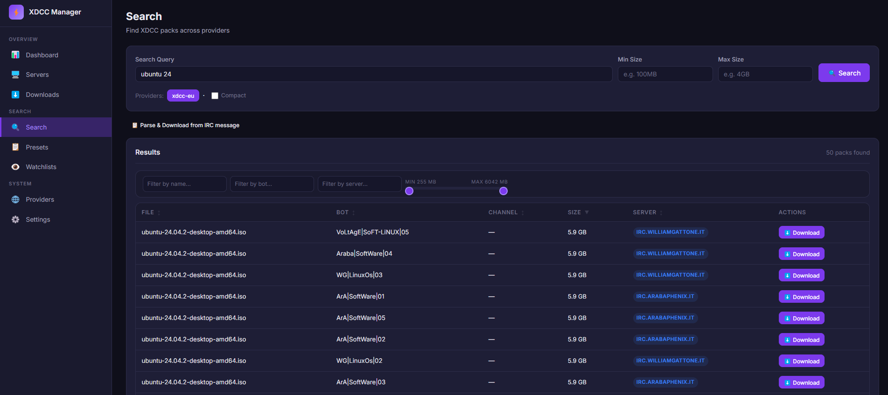
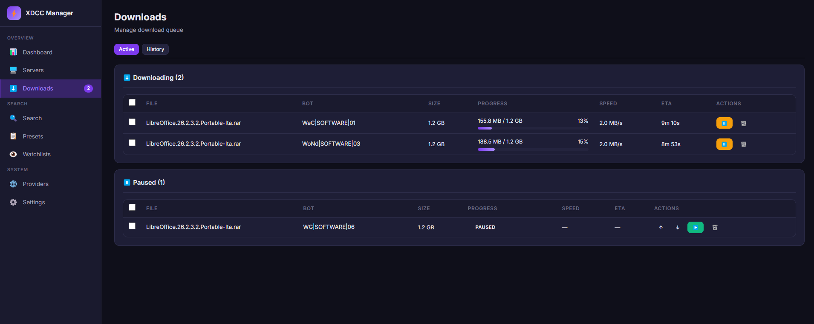
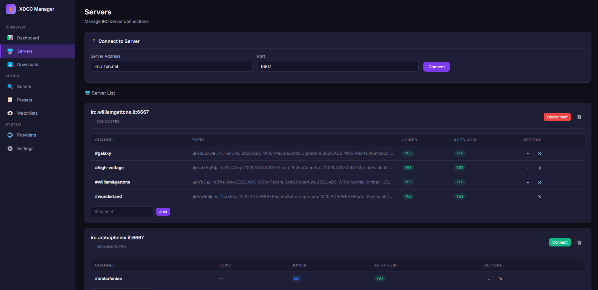
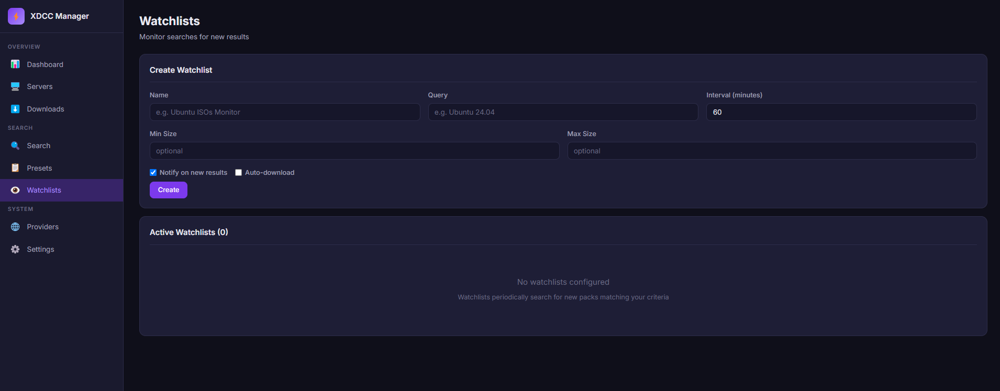

<div align="center">

# xdcc_server

**High-Performance XDCC Downloader for IRC**

[](https://go.dev/)
[](LICENSE)
[](https://www.docker.com/)
[](https://github.com/asgambat/xdcc_server)
[](https://github.com/asgambat/xdcc_server/actions/workflows/ci.yml)

*A modern XDCC downloader with daemon server, REST API, web UI, and powerful CLI tools for IRC file transfers*

[Features](#features) •
[Quick Start](#quick-start) •
[Installation](#installation) •
[Documentation](#documentation) •
[Development](#development)

</div>

---

## 📖 Table of Contents

- [Overview](#overview)
- [Features](#features)
- [Architecture](#architecture)
- [Quick Start](#quick-start)
  - [Option 1: Docker](#option-1-docker-recommended)
  - [Option 2: Pre-built Binaries](#option-2-pre-built-binaries)
  - [Option 3: Build from Source](#option-3-build-from-source)
- [Screenshots](#screenshots)
- [Installation](#installation)
  - [Pre-built Binaries](#pre-built-binaries)
  - [Build from Source](#build-from-source)
  - [Docker](#docker)
    - [Non-Root User](#non-root-user)
    - [Pre-built Multi-Architecture Images](#pre-built-multi-architecture-images)
    - [Build from Source (Docker)](#build-from-source-docker)
    - [Docker Compose](#docker-compose-production)
    - [Building Multi-Architecture Images Locally](#building-multi-architecture-images-locally)
- [Usage](#usage)
  - [Server Mode](#server-mode)
  - [REST API Highlights](#rest-api-highlights)
  - [CLI Tools](#cli-tools)
- [Configuration](#configuration)
- [Documentation](#documentation)
  - [xdcc-server](#xdcc-server)
- [xdcc-dl](#xdcc-dl)
- [xdcc-search](#xdcc-search)
- [xdcc-browse](#xdcc-browse)
- [Technical Details](#technical-details)
  - [Retry Behavior](#retry-behavior)
  - [Contract Notes](#searchpresetwatchlist-contract-notes)
  - [Network Resilience](#network-resilience)
- [Troubleshooting](#troubleshooting)
  - [Common Issues](#common-issues-solutions)
  - [FAQ](#faq)
- [Development](#development)
- [Contributing](#contributing)
- [License](#license)

---

## 🔍 Overview

**xdcc_server** is a high-performance XDCC downloader for IRC written in pure Go. It provides both a persistent daemon server with a modern web interface and standalone command-line tools for searching, browsing, and downloading files from IRC XDCC bots.

### Key Highlights

- **🚀 Fast & Reliable**: Pure Go implementation with zero CGO dependencies
- **🌐 Dual-Mode Architecture**: Standalone CLI tools or centralized server management
- **💻 Modern Web UI**: Responsive Svelte 5 PWA with real-time updates
- **🔄 Smart Retry Logic**: Conditional auto-retry with configurable fallback policy and retry limits
- **📦 Multi-Provider Search**: Aggregated search across multiple XDCC sources
- **🐳 Docker Ready**: Single-command deployment with persistent storage
- **🔧 Developer Friendly**: Task automation, hot reload, comprehensive tests

### Use Cases

- **End Users**: Download files from IRC XDCC bots via web interface or CLI
- **Power Users**: Batch downloads, automated watchlists, search presets
- **Developers**: Integrate XDCC downloads into your applications via REST API
- **Self-Hosters**: Run your own XDCC download server on Raspberry Pi or cloud

---

## ✨ Features

### Core Architecture

| Component | Description |
|-----------|-------------|
| **xdcc-server** | Persistent daemon with REST API, web UI, and multi-server IRC management |
| **xdcc-dl** | CLI tool for downloading packs (standalone or server-delegated) |
| **xdcc-search** | CLI tool for searching multiple providers with parsable output |
| **xdcc-browse** | Interactive TUI for search → filter → select → download workflow |

### Server Capabilities

<details>
<summary><strong>🖥️ Web Interface (Svelte 5 PWA)</strong></summary>

- **Dashboard**: Real-time overview of active downloads, disk space, and server status
- **Servers**: Manage multiple IRC server connections and channels
- **Downloads**: Full queue management with pause/resume/retry/reorder capabilities
- **Search**: Aggregated multi-provider search with advanced filters
- **Presets**: Save and reuse search queries with custom filters
- **Watchlists**: Automatic monitoring for new releases
- **Providers**: Health monitoring, latency stats, and runtime enable/disable
- **Settings**: Centralized server configuration

</details>

<details>
<summary><strong>🔍 Search & Discovery</strong></summary>

**Multi-Provider Support:**
- **xdcc-eu** - General XDCC search engine
- **nibl** - Anime-focused XDCC bot network
- **subsplease** - Latest anime releases

**Search Features:**
- Parallel provider queries with result aggregation
- Two-tier caching (fresh: 30m, stale fallback: 24h)
- Smart deduplication by filename, size, and bot family
- Advanced server-side filters: extension, bot name, filename prefix, media type (video/audio/books/archives), file size range, HQ mode (excludes low-quality packs), and prefix matching
- Web UI client-side filtering: filename, bot, server, and dual range size sliders
- Compact mode for cleaner results
- Sortable columns: filename, bot, channel, size, server
- Adjustable page size (10/50/100/200/500 results)
- Search history with dropdown autocomplete
- Quick "Parse & Download" from raw IRC messages
- Save search parameters as named presets for reuse

</details>

<details>
<summary><strong>📦 Download Management</strong></summary>

**DCC Protocol Support:**
- Full DCC SEND implementation
- DCC RESUME/ACCEPT for partial file resumption
- Real-time progress tracking (bytes, speed, ETA, percentage)
- Stall detection with configurable timeout
- Per-download bandwidth throttling

**Smart Features:**
- Automatic IRC server detection from bot name prefixes
- DNS fallback resolver for blocked networks
- Multi-IP connection failover
- Standalone CLI retries timeout/download-failed packs up to 3 attempts
- Server queue fallback is configurable (`suggest_only` or `auto_retry_best`)
- Configurable file conflict policies (skip/overwrite/rename)

**Pack Number Syntax:**
```
#5          Single pack
#1-10       Range (packs 1 through 10)
#1-10;2     Step range (every 2nd: 1, 3, 5, 7, 9)
#1,3,7      Specific packs
```

</details>

<details>
<summary><strong>🔄 IRC Connection Management</strong></summary>

**CLI Tools (Ephemeral):**
- One-shot connections per download
- Automatic channel discovery via WHOIS
- Fallback channel support
- Configurable timing and delays

**Server Daemon (Persistent):**
- Multiple simultaneous IRC server connections
- Exponential backoff auto-reconnect
- Channel auto-join on connect
- Connection pooling and reuse

</details>

<details>
<summary><strong>💾 Persistence & Storage</strong></summary>

- **SQLite Database**: All server state (queue, config, watchlists, presets)
- **Zero Dependencies**: Embedded database, no external services required
- **Docker Optimized**: All data in `/data` volume for easy persistence
- **Automatic Cleanup**: Configurable retention policies for old downloads

</details>

### Platform Support

- **Linux**: x86_64, ARM64 (Raspberry Pi 4/5)
- **macOS**: Intel (x86_64), Apple Silicon (ARM64)
- **Windows**: x86_64, ARM64
- **Docker**: Multi-architecture support (linux/amd64, linux/arm64)

---

## 🏗️ Architecture

```
┌─────────────────────────────────────────────────────────────────┐
│                       xdcc_server System                        │
├─────────────────────────────────────────────────────────────────┤
│                                                                 │
│  ┌──────────────┐     ┌───────────────┐    ┌──────────────┐     │
│  │   xdcc-dl    │───▶│               │     │   xdcc-     │      │
│  │   (CLI)      │     │  xdcc-server  │◀───│   browse    │      │
│  └──────────────┘     │   (Daemon)    │    │   (TUI)      │     │
│                       │               │    └──────────────┘     │
│  ┌──────────────┐     │  • REST API   │                         │
│  │  xdcc-search │───▶│  • Web UI     │                          │
│  │   (CLI)      │     │  • IRC Manager│                         │
│  └──────────────┘     │  • Queue Mgmt │                         │
│                       └───────┬───────┘                         │
│                               │                                 │
│                       ┌───────▼───────┐                         │
│                       │   SQLite DB   │                         │
│                       │  • Downloads  │                         │
│                       │  • Config     │                         │
│                       │  • Watchlists │                         │
│                       └───────────────┘                         │
│                                                                 │
└─────────────────────────────────────────────────────────────────┘
```

**Operating Modes:**

1. **Standalone CLI**: Direct IRC connections for one-off downloads
2. **Client-Server**: CLI tools delegate to server via REST API
3. **Web UI**: Full-featured browser-based interface with real-time updates

---

## 🚀 Quick Start

### Option 1: Docker (Recommended)

The fastest way to get started:

```bash
docker run -d \
  --name xdcc-server \
  -p 8080:8080 \
  -v xdcc-data:/data \
  ghcr.io/asgambat/xdcc_server:latest
```

Open **http://localhost:8080** in your browser.

> For building the Docker image locally, see [Build from Source (Docker)](#build-from-source-docker).

### Option 2: Pre-built Binaries

Pre-compiled binaries are automatically built for every release and available on the [Releases page](https://github.com/asgambat/xdcc_server/releases).

**Supported Platforms:**
- **Linux**: x86_64, ARM64
- **macOS**: Intel (x86_64), Apple Silicon (ARM64)
- **Windows**: x86_64, ARM64

**Available Tools:**
- `xdcc-server` - Server daemon with web UI and REST API
- `xdcc-dl` - Command-line download tool
- `xdcc-search` - Multi-provider search tool
- `xdcc-browse` - Interactive TUI browser

Each binary is distributed as a separate archive containing:
- The executable
- `LICENSE` file
- Default `config.yaml`

**Quick Install:**

```bash
# Linux x86_64
wget https://github.com/asgambat/xdcc_server/releases/latest/download/xdcc-server-v1.0.0-linux-amd64.tar.gz
tar xzf xdcc-server-v1.0.0-linux-amd64.tar.gz
chmod +x xdcc-server
./xdcc-server

# macOS (Intel)
curl -L https://github.com/asgambat/xdcc_server/releases/latest/download/xdcc-server-v1.0.0-darwin-amd64.tar.gz | tar xz
chmod +x xdcc-server
./xdcc-server

# macOS (Apple Silicon)
curl -L https://github.com/asgambat/xdcc_server/releases/latest/download/xdcc-server-v1.0.0-darwin-arm64.tar.gz | tar xz
chmod +x xdcc-server
./xdcc-server

# Windows (PowerShell)
Invoke-WebRequest -Uri "https://github.com/asgambat/xdcc_server/releases/latest/download/xdcc-server-v1.0.0-windows-amd64.zip" -OutFile "xdcc-server.zip"
Expand-Archive xdcc-server.zip -DestinationPath .
.\xdcc-server.exe
```

**Verify Downloads:**

Each release includes a `checksums.txt` file with SHA256 hashes:

```bash
# Linux/macOS
wget https://github.com/asgambat/xdcc_server/releases/latest/download/checksums.txt
sha256sum -c checksums.txt --ignore-missing

# Windows (PowerShell)
Get-FileHash .\xdcc-server-*.zip -Algorithm SHA256
```

### Option 3: Build from Source

```bash
git clone https://github.com/asgambat/xdcc_server
cd xdcc_server

# Using Task (recommended for development)
task all     # Builds frontend + all binaries
task run     # Start the server

# Or using Go directly
cd web && npm install && npm run build && cd ..
go build -o xdcc-server ./cmd/xdcc-server
./xdcc-server
```

---

## 📸 Screenshots

### Web UI Dashboard


*Real-time overview of active downloads, server status, and system resources*

### Search Interface


*Multi-provider search with advanced filtering and result aggregation*

### Download Queue Management


*Manage your download queue with pause, resume, retry, and reordering capabilities*

### Server & Channel Management


*Configure and monitor multiple IRC server connections*

### Watchlists & Automation


*Automated monitoring for new releases matching your criteria*

---

## 📦 Installation

### Requirements

**For Using Pre-built Binaries:**
- No requirements! Just download and run.

**For Building from Source:**

| Requirement | Version | Purpose |
|-------------|---------|---------|
| **Go** | 1.25+ | Building from source |
| **Node.js** | 18+ | Building the web UI |
| **npm** | Latest | Frontend dependencies |
| **[Task](https://taskfile.dev)** | Latest | Development automation (optional) |

### Pre-built Binaries

Pre-compiled binaries are automatically built and published for every release.

> **Automated Releases**: Releases are automatically built and published by GitHub Actions when a version tag (e.g., `v1.0.0`) is pushed. See [Development → CI/CD Pipeline](#cicd-pipeline) for details on the automated release workflow.

### Build from Source

#### Using Task (Recommended)

[Task](https://taskfile.dev) simplifies the build process (clone the repo first as shown in [Quick Start](#option-3-build-from-source)):

```bash
# 1. Install Task (if not already installed)
# macOS/Linux:
sh -c "$(curl --location https://taskfile.dev/install.sh)" -- -d -b /usr/local/bin
# Windows (Scoop):
scoop install task
# Or see: https://taskfile.dev/installation/

# 2. Install dependencies
task deps

# 3. Build everything (frontend + all binaries)
task all

# 4. Binaries will be in the bin/ directory
ls bin/
# xdcc-server  xdcc-dl  xdcc-search  xdcc-browse
```

#### Using Go Directly

Manual build process (clone the repo first as shown in [Quick Start](#option-3-build-from-source)):

```bash
# 1. Build the frontend
cd web
npm install
npm run build
cd ..

# 2. Build the Go binaries
go build -ldflags="-s -w" -o xdcc-server ./cmd/xdcc-server
go build -ldflags="-s -w" -o xdcc-dl ./cmd/xdcc-dl
go build -ldflags="-s -w" -o xdcc-search ./cmd/xdcc-search
go build -ldflags="-s -w" -o xdcc-browse ./cmd/xdcc-browse

# 3. Run the server
./xdcc-server
```

### Docker

#### 🔒 Non-Root User

The container runs as a **non-root** user `xdcc` with UID:GID `1000:1000` by default.
This improves security and simplifies host volume permissions.

To override the UID/GID, pass `--user` to `docker run` or set the `UID` and `GID`
environment variables when using docker-compose (see [Docker Compose](#docker-compose-production) for details).

> **Note:** When changing UID/GID, existing volumes may have stale permissions from
> previous runs. Fix them with:
> ```bash
> docker-compose down
> docker run --rm -v xdcc-data:/data alpine chown -R 1001:1001 /data
> docker run --rm -v xdcc-db:/db alpine chown -R 1001:1001 /db
> docker-compose up -d
> ```

#### Pre-built Multi-Architecture Images

Official Docker images are available on GitHub Container Registry with support for multiple architectures.
Pull the latest image as shown in [Quick Start](#quick-start), or use a specific version tag:

```bash
docker run -d \
  --name xdcc-server \
  -p 8080:8080 \
  -v xdcc-data:/data \
  ghcr.io/asgambat/xdcc_server:v1.0.0

open http://localhost:8080
```

**Supported Architectures:**
- `linux/amd64` - x86_64 (Intel/AMD 64-bit)
- `linux/arm64` - ARM 64-bit (Raspberry Pi 4, Apple Silicon, AWS Graviton)
Docker automatically pulls the correct image for your platform.

**Available Tags:**
- `latest` - Latest stable release
- `v1.0.0`, `v1.0`, `v1` - Semantic versioning tags
- New images are automatically built and published when a release tag is created

#### Build from Source (Docker)

```bash
# Build the image locally (default UID:GID=1000:1000)
docker build -t xdcc_server .

# Build with custom UID/GID
docker build --build-arg UID=$(id -u) --build-arg GID=$(id -g) -t xdcc_server .

# Run the container (default non-root user)
docker run -d \
  --name xdcc-server \
  -p 8080:8080 \
  -v xdcc-data:/data \
  xdcc_server
```

The `/data` volume persists:
- Downloaded files (`/data/downloads/complete/`)
- Partial downloads (`/data/downloads/tmp/`)
- Logs (`/data/logs/`)

The database lives on a separate volume at `/var/lib/xdcc-server/db`.

#### Docker Compose (Production)

The container runs as a **non-root** user (`xdcc`, UID:GID `1000:1000`).
Override UID/GID via environment variables or a `.env` file.

The project includes a ready-to-use `docker-compose.yml` with separate volumes for
database and data, and a configurable non-root user.

```yaml
version: '3.8'

services:
  xdcc-server:
    image: ghcr.io/asgambat/xdcc_server:latest
    # Or build locally: build: .
    container_name: xdcc-server
    restart: unless-stopped

    # Non-root user (default 1000:1000, override via UID/GID env vars)
    user: "${UID:-1000}:${GID:-1000}"

    ports:
      - "8080:8080"
    volumes:
      - xdcc-db:/var/lib/xdcc-server/db     # SQLite database
      - xdcc-data:/data                       # Downloads + logs
    environment:
      - XDCC_HTTP_PORT=8080
      - XDCC_HTTP_BIND_ADDRESS=0.0.0.0
      - XDCC_LOGGING_LEVEL=info
      - XDCC_STORAGE_DB_PATH=/var/lib/xdcc-server/db

volumes:
  xdcc-db:
    driver: local
  xdcc-data:
    driver: local
```

Start the service (copy `.env.example` to `.env` to customize variables):

```bash
# Default (UID=1000, GID=1000)
docker-compose up -d

# With custom UID/GID
UID=1001 GID=1001 docker-compose up -d

# Logs
docker-compose logs -f xdcc-server
```

#### Building Multi-Architecture Images Locally

For building custom multi-arch images (e.g., for testing):

```bash
# Create and use a buildx builder
docker buildx create --use --name multiarch-builder

# Build for multiple platforms
docker buildx build \
  --platform linux/amd64,linux/arm64 \
  -t xdcc_server:local \
  --load \
  .
```

**Note:** Official multi-architecture images are automatically built and published to GitHub Container Registry when a new version tag (e.g., `v1.0.0`) is pushed to the repository.

---

## 💻 Usage

### Server Mode

The server provides persistent IRC connections, a download queue, and a web interface:

```bash
# Start with default configuration
xdcc-server

# Start with custom config
xdcc-server --config /path/to/config.yaml

# Override the database path (full file path)
xdcc-server --db /data/xdcc/custom-name.db

# Override specific settings
xdcc-server --port 9090 --download-dir /downloads
```

On startup, the server logs its configuration and database paths (see the [Flags section](#flags) under xdcc-server for details).

Access the web UI at **http://localhost:8080**

### REST API Highlights

- Health and readiness probes: `GET /healthz`, `GET /readyz`
- Quick-add parser for raw XDCC messages: `POST /api/xdcc/parse`
- Setup wizard bootstrap endpoints: `GET /api/setup/status`, `POST /api/setup/bootstrap`
- Data backup/restore endpoints: `POST /api/admin/export`, `POST /api/admin/import`
- Runtime logs and event stream: `GET /api/logs`, `GET /api/events` (SSE)

**Systemd Service (Linux):**

For full systemd installation instructions (including user setup, permissions, and auto-start configuration), see [Documentation → xdcc-server → Systemd](#systemd-linux).

### CLI Tools

All CLI tools can operate in two modes:

1. **Standalone**: Direct IRC connection (no server needed)
2. **Delegated**: Connect to running server via `--command-server` flag

#### Quick Examples

```bash
# Download a pack (standalone)
xdcc-dl "/msg BotName xdcc send #42"

# Search for content
xdcc-search "anime title"

# Interactive browse and select
xdcc-browse "anime title"

# Download via server (delegated mode)
xdcc-dl "/msg BotName xdcc send #42" --command-server=http://localhost:8080

# Search with filters
xdcc-browse "anime title" --ext=mkv --bot=WOND

# Download range of packs
xdcc-dl "/msg BotName xdcc send #1-10" -o /downloads

# Throttled download
xdcc-dl "/msg BotName xdcc send #42" --throttle=2M
```

For detailed usage of each tool, see the [Documentation](#documentation) section below.

---

## ⚙️ Configuration

### Configuration Priority

Settings are loaded in the following order (later overrides earlier):

1. `config.yaml` file
2. Environment variables (e.g., `XDCC_HTTP_PORT`)
3. CLI flags (e.g., `--port 9090`)

### Key Environment Variables

| Variable | Default | Description |
|----------|---------|-------------|
| `XDCC_HTTP_PORT` | `8080` | HTTP server port |
| `XDCC_HTTP_BIND_ADDRESS` | `127.0.0.1` | HTTP server bind address (use `0.0.0.0` for Docker/external access) |
| `XDCC_IRC_NICKNAME` | `xdcc-user` | Base IRC nickname (random suffix added) |
| `XDCC_DOWNLOAD_TEMP_DIR` | `./downloads/tmp` | Temporary directory for in-progress downloads |
| `XDCC_DOWNLOAD_DEST_DIR` | `./downloads/complete` | Destination for completed downloads |
| `XDCC_DOWNLOAD_MAX_PARALLEL` | `5` | Maximum parallel downloads |
| `XDCC_DOWNLOAD_STARTUP_DELAY_MINUTES` | `0` | Delay in minutes before queue starts processing downloads on startup |
| `XDCC_DOWNLOAD_CHANNEL_JOIN_DELAY` | `-1` | Seconds to wait after connecting before WHOIS (`-1` = random 5–10s, `0` = no delay, `>0` = fixed) |
| `XDCC_DOWNLOAD_MIN_DISK_SPACE` | `1GB` | Minimum free disk space before pausing |
| `XDCC_DOWNLOAD_MAX_RETRY` | `3` | Maximum auto-retry attempts when `XDCC_DOWNLOAD_FAIL_FALLBACK=auto_retry_best` |
| `XDCC_DOWNLOAD_FAIL_FALLBACK` | `suggest_only` | Queue fallback mode on failed downloads (`suggest_only`, `auto_retry_best`) |
| `XDCC_STORAGE_DB_PATH` | `./db` | Directory for the SQLite database file (filename is always `xdcc-server.db`) |
| `XDCC_DOWNLOAD_CONFLICT_POLICY` | `skip` | File conflict handling (`skip`, `overwrite`, `rename`) |
| `XDCC_DOWNLOAD_MAX_RATE_BPS` | `0` | Global download rate limit (bytes/s, 0 = unlimited) |
| `XDCC_LOGGING_LEVEL` | `info` | Log level (`debug`, `info`, `warn`, `error`) |
| `XDCC_LOGGING_FILE_PATH` | *(stderr)* | Log file path (empty = stderr) |
| `XDCC_SEARCH_CACHE_ENABLED` | `true` | Enable search result caching |
| `XDCC_SEARCH_PROVIDER_TIMEOUT` | `5` | Timeout per search provider (seconds) |
| `XDCC_SEARCH_PAGE_SIZE` | `50` | Default page size for search results |
| `XDCC_SECURITY_ADMIN_TOKEN` | *(auto-generated)* | Admin token for protected API endpoints |
| `XDCC_STORAGE_DOWNLOADS_RETENTION` | `30d` | Retention period for completed/failed downloads |
| `XDCC_STORAGE_CLEANUP_INTERVAL` | `12h` | Interval between periodic cleanup runs |

### Database Configuration

The SQLite database (`xdcc-server.db`) location can be configured in three ways, listed in increasing priority:

| # | Method | Example | Notes |
|---|--------|---------|-------|
| 1 | **Config file** | `storage.db_path: ./db` | Directory only; filename is always `xdcc-server.db` |
| 2 | **Environment variable** | `XDCC_STORAGE_DB_PATH=/var/lib/xdcc-server/db` | Directory only; overrides config file |
| 3 | **CLI flag** | `xdcc-server --db /custom/path/custom.db` | Full file path; overrides both config and env var |

**Priority:** CLI flag > environment variable > config file

**Default location:** `./db/xdcc-server.db` (relative to the working directory)

**Auto-creation:** The database directory is created automatically on server startup if it doesn't exist.

```bash
# Method 1 — config.yaml
storage:
  db_path: "./db"  # → ./db/xdcc-server.db

# Method 2 — environment variable
export XDCC_STORAGE_DB_PATH=/var/lib/xdcc-server/db  # → /var/lib/xdcc-server/db/xdcc-server.db

# Method 3 — CLI flag (highest priority, accepts full file path)
xdcc-server --db /data/xdcc/custom-name.db
```

> **Note:** The config file and environment variable specify only the **directory** — the filename is always `xdcc-server.db`. The CLI flag, on the other hand, accepts a **full file path**, allowing you to customize both the directory and the filename.

### Configuration File Example

```yaml
irc:
  nickname: "my-xdcc-bot"
  default_servers:
    - address: "irc.rizon.net"
      port: 6667
      auto_connect: true

http:
  port: 8080
  bind_address: "127.0.0.1"
  cors_origins: []

security:
  admin_token: ""
  token_ttl_minutes: 15

download:
  temp_dir: "./downloads/tmp"
  dest_dir: "./downloads/complete"
  min_disk_space_bytes: 1073741824  # 1 GB
  max_retry_attempts: 3
  startup_delay_minutes: 0
  conflict_policy: "skip"
  max_parallel_total: 5
  max_rate_bps: 0  # unlimited

storage:
  db_path: "./db"  # directory for SQLite database (filename is always xdcc-server.db)

logging:
  level: "info"
  file_path: "./logs/xdcc-server.log"
```

See `config.yaml` in the repository for the complete configuration reference.

### CLI Configuration

All CLI tools support configuration via flags. For a complete list of available flags with defaults and descriptions, see the [xdcc-dl Flags](#flags-1) section.

---

## 📚 Documentation

### xdcc-server

Persistent daemon that manages IRC connections and downloads. Exposes a REST API and serves a web UI.

```sh
xdcc-server [flags]
```

### Flags

| Flag | Default | Description |
|---|---|---|
| `--config` / `-c` | `config.yaml` | Path to configuration file |
| `--db` / `-d` | *(from config `storage.db_path`)* | Full path to SQLite database file (overrides config db_path directory) |
| `--port` | *(from config)* | HTTP server port (overrides config) |
| `--download-dir` | *(from config)* | Destination directory for completed downloads |
| `--temp-dir` | *(from config)* | Temporary directory for in-progress downloads |

On startup, the server logs the config and database paths:

```
config: /etc/xdcc-server/config.yaml
database: /var/lib/xdcc-server/db/xdcc-server.db
```

The database directory is automatically created if it doesn't exist.

Configuration priority: see [Configuration → Configuration Priority](#configuration-priority) for details.

### Systemd (Linux)

An example systemd unit file is provided in `examples/xdcc-server.service`:

```sh
# Create the xdcc user
sudo adduser --system --no-create-home xdcc

# Create data directories
sudo mkdir -p /var/lib/xdcc-server/downloads/{tmp,complete}
sudo mkdir -p /var/log/xdcc-server
sudo chown -R xdcc:xdcc /var/lib/xdcc-server /var/log/xdcc-server

# Copy the binary and config
sudo cp xdcc-server /usr/local/bin/
sudo mkdir -p /etc/xdcc-server
sudo cp config.yaml /etc/xdcc-server/

# Install and enable the service
sudo cp examples/xdcc-server.service /etc/systemd/system/
sudo systemctl daemon-reload
sudo systemctl enable --now xdcc-server

# Check status
sudo systemctl status xdcc-server

# View logs
sudo journalctl -u xdcc-server -f
```

The server auto-starts on boot (`WantedBy=multi-user.target`) with `Restart=on-failure` and a 10-second delay between restarts.

---

## xdcc-dl

Download one or more packs by passing the XDCC message string.

```sh
xdcc-dl <message> [flags]
```

### Message Format

```
/msg <bot> xdcc send #<pack>
```

Pack numbers support ranges, steps, and lists (see **Features** section for full syntax).

### Flags

| Flag | Short | Default | Description |
|---|---|---|---|
| `--command-server` | | *(none)* | Delegate download to a remote xdcc-server (e.g. `http://localhost:8080`) |
| `--server` | `-s` | *(auto)* | IRC server (`host` or `host:port`). Overrides automatic server detection from bot name |
| `--out` | `-o` | `.` | Output directory or file path |
| `--throttle` | `-t` | `-1` | Speed limit in bytes/s (e.g. `512K`, `2M`, `1G`). `-1` = unlimited |
| `--connect-timeout` | `-C` | `120` | Seconds to wait for the bot to initiate the DCC transfer |
| `--stall-timeout` | `-S` | `60` | Seconds of no transfer progress before aborting. `0` = disabled |
| `--fallback-channel` | `-f` | *(none)* | IRC channel to join if WHOIS returns no channels for the bot |
| `--wait-time` | `-w` | `0` | Extra seconds to wait before sending the XDCC request |
| `--username` | `-u` | *(random)* | IRC nickname (a random suffix is always appended) |
| `--channel-join-delay` | `-D` | `-1` | Seconds to wait after connecting before sending WHOIS. `-1` = random 5–10 s |
| `--dns-server` | `-d` | `8.8.8.8:53` | Fallback DNS resolver when system DNS is blocked (`host:port`) |
| `--verbose` | `-v` | | Increase verbosity (repeatable: `-v`, `-vv`) |
| `--quiet` | `-q` | | Reduce output (repeatable: `-q`, `-qq`) |

### Verbosity levels

| Flag | Shows |
|---|---|
| *(default)* | Connecting, download progress, final result |
| `-v` | + bot notices, channel joins, WHOIS results |
| `-vv` | + DNS resolution, DCC details, all IRC events |
| `-q` | Hides connection info; keeps errors, bot notices, and progress |
| `-qq` | Suppresses all output |

> If `-q` and `-v` are used together, `-q` takes precedence and `-v` is ignored.

### Examples

```sh
# Download a single pack (standalone)
xdcc-dl "/msg WoNd|SERIE-TV|04 xdcc send #2407"

# Delegate download to a running server (server manages IRC)
xdcc-dl "/msg WoNd|SERIE-TV|04 xdcc send #2407" --command-server=http://localhost:8080

# Download with verbose output and custom output directory
xdcc-dl "/msg WoNd|SERIE-TV|04 xdcc send #2407" -v -o /tmp/downloads

# Download a range of packs with speed cap
xdcc-dl "/msg MyBot xdcc send #1-10" --throttle=2M

# Override server (useful if DNS is blocked on your network)
xdcc-dl "/msg WoNd|SERIE-TV|04 xdcc send #2407" --server=94.23.150.97:6667

# Full debug output
xdcc-dl "/msg MyBot xdcc send #5" -vv
```

---

## xdcc-search

Search for packs and print one result per line with the corresponding `xdcc-dl` command.

```sh
xdcc-search <search_term> [engine] [flags]
```

The engine can be passed as a second positional argument or via `--search-engine`. Default is `xdcc-eu`.

Available engines: `xdcc-eu`, `nibl`, `subsplease`

### Flags

| Flag | Short | Default | Description |
|---|---|---|---|
| `--search-engine` | `-e` | `xdcc-eu` | Search engine to use |
| `--compact` | `-c` | `false` | Remove duplicate results with same filename, size and bot family |
| `--prefix` | `-p` | `false` | Keep only results whose filename starts with the search term (case-insensitive) |
| `--verbose` | `-v` | | Show search engine debug info |

### Output format

```
<filename> [<size>] (xdcc-dl "<message>" [--server <host>])
```

### Examples

```sh
# Search using the default engine (xdcc-eu)
xdcc-search "my show"

# Specify engine as positional argument
xdcc-search "my show" nibl

# Only results whose filename starts with the search term
xdcc-search "my show" --prefix

# Verbose (shows HTTP requests and parsing details)
xdcc-search "my show" -v

# Pipe into grep
xdcc-search "my show" | grep -i "s01e03"
```

---

## xdcc-browse

Interactive search → filter → numbered list → selection → download.

```sh
xdcc-browse <search_term> [flags]
```

### Flags

| Flag | Short | Default | Description |
|---|---|---|---|
xdcc-browse also supports all shared flags documented in [xdcc-dl](#flags-1) (`--server`, `--out`, `--throttle`, `--connect-timeout`, `--stall-timeout`, `--fallback-channel`, `--wait-time`, `--username`, `--channel-join-delay`, `--dns-server`, `--verbose`, `--quiet`).

| Flag | Short | Default | Description |
|---|---|---|---|
| `--command-server` | | *(none)* | Delegate search and download to a remote xdcc-server (e.g. `http://localhost:8080`) |
| `--search-engine` | `-e` | `xdcc-eu` | Search engine to use: `nibl`, `xdcc-eu`, `subsplease` |
| `--ext` | `-x` | *(none)* | Filter results by file extension(s), comma-separated (e.g. `mkv,avi,mp4`) |
| `--bot` | `-b` | *(none)* | Filter results by bot name substring, case-insensitive (e.g. `WOND`) |
| `--prefix` | `-p` | `false` | Keep only results whose filename starts with the search term (case-insensitive) |
| `--compact` | `-c` | `false` | Remove duplicate results with same filename, size and bot family |

### Selection syntax

After the numbered list is shown you will be prompted for a selection:

| Input | Meaning |
|---|---|
| `3` | single pack |
| `1-5` | range (packs 1 through 5) |
| `1+5` | count (5 consecutive packs starting from 1, i.e. packs 1–5) |
| `1,3,7` | comma-separated list |
| `all` | download everything in the list |

### Examples

```sh
# Basic interactive search
xdcc-browse "my show"

# Delegate search + download to a running server
xdcc-browse "my show" --command-server=http://localhost:8080

# Filter to MKV files only from bots containing "WOND"
xdcc-browse "my show" --ext=mkv --bot=WOND

# Only results whose filename starts with the search term
xdcc-browse "my show" --prefix

# Use a different engine and save to a specific directory
xdcc-browse "my show" --search-engine=nibl -o /downloads

# Verbose download after selection
xdcc-browse "my show" -v

# Filter and override server
xdcc-browse "my show" --ext=mkv --server=94.23.150.97
```

---

## Technical Details

### Retry Behavior

| Error Type | Behavior |
|------------|----------|
| Timeout / download failed (standalone CLI) | Retry up to 3 times after reconnect (no exponential backoff) |
| Failed download (server queue mode) | Default `suggest_only` (no auto-retry); `auto_retry_best` re-queues up to `XDCC_DOWNLOAD_MAX_RETRY` |
| "Pack already requested" (standalone CLI) | Wait 60 seconds, then retry |
| Bot denied / slot busy | Abort immediately, show bot message |
| Bot not found | Abort immediately |
| Server unreachable | Try all resolved IPs, then abort with suggestion |
| File already exists | Follow conflict policy (skip/overwrite/rename) |

### Search/Preset/Watchlist Contract Notes

- Presets and watchlists are persisted with `filters_json` in storage.
- Search API supports server-side filters: `q`, `prefix`, `bot`, `ext`, `compact`, `min_size`, `max_size`, `video_only`, `audio_only`, `books_only`, `zip_only`, `providers`, `page`, and `pageSize`.
- Preset/watchlist `filters_json` stores providers, min/max size for reuse during watchlist execution.
- The `notify` field is stored but is not currently mapped to notification delivery.

### Network Resilience

**DNS Fallback:**
When system DNS returns blocked addresses (`0.0.0.0`, `::`) or fails, the client automatically retries via a public DNS resolver. The resolved IP is passed directly to the IRC library to prevent further blocked lookups.

**Multi-IP Failover:**
Hostnames are resolved to all available IPs (system DNS + fallback combined). If connection to the first IP fails, subsequent IPs are tried automatically until success or exhaustion. Progress is logged (e.g., `IP 2/3: connecting...`).

**Server Auto-Detection:**
IRC servers are detected from bot name prefixes:
- `TLT*` → `irc.williamgattone.it`
- `WeC*` → `irc.explosionirc.net`
- `WoNd*` → `irc.williamgattone.it`
- Default fallback: `irc.rizon.net`

Use `--server` to override auto-detection or bypass blocked DNS.

---

## 🔧 Troubleshooting

### Common Issues & Solutions

<details>
<summary><strong>❌ "Connection refused" or "Unable to reach server"</strong></summary>

**Symptoms:**
- CLI tools cannot connect to xdcc-server
- Web UI shows connection errors

**Solutions:**
1. Verify the server is running:
   ```bash
   curl http://localhost:8080/api/version
   ```

2. Check if the port is correct:
   ```bash
   # Server
   xdcc-server --port 8080
   
   # CLI
   xdcc-dl "/msg Bot xdcc send #5" --command-server=http://localhost:8080
   ```

3. Check firewall settings (Docker/systemd):
   ```bash
   # Linux
   sudo ufw allow 8080/tcp
   
   # Docker
   docker ps  # Verify port mapping shows 8080:8080
   ```

</details>

<details>
<summary><strong>❌ "DNS resolution failed" or "Server not found"</strong></summary>

**Symptoms:**
- IRC connection fails with DNS errors
- Cannot resolve IRC server hostname

**Solutions:**
1. Use fallback DNS resolver:
   ```bash
   xdcc-dl "/msg Bot xdcc send #5" --dns-server=1.1.1.1:53
   ```

2. Override IRC server with IP address:
   ```bash
   xdcc-dl "/msg Bot xdcc send #5" --server=94.23.150.97:6667
   ```

3. Check your network's DNS settings:
   ```bash
   nslookup irc.rizon.net
   nslookup irc.rizon.net 8.8.8.8
   ```

</details>

<details>
<summary><strong>❌ "Bot not found" or "No response from bot"</strong></summary>

**Symptoms:**
- Download hangs waiting for bot response
- WHOIS returns no results

**Solutions:**
1. Verify bot name is correct (case-sensitive):
   ```bash
   # Wrong: /msg mybot xdcc send #5
   # Right: /msg MyBot xdcc send #5
   ```

2. Specify a fallback channel:
   ```bash
   xdcc-dl "/msg Bot xdcc send #5" --fallback-channel="#xdcc"
   ```

3. Increase wait times:
   ```bash
   xdcc-dl "/msg Bot xdcc send #5" --wait-time=10 --connect-timeout=180
   ```

</details>

<details>
<summary><strong>❌ "Transfer stalled" or "No progress"</strong></summary>

**Symptoms:**
- Download starts but stops making progress
- Speed drops to 0 KB/s

**Solutions:**
1. Adjust stall timeout:
   ```bash
   xdcc-dl "/msg Bot xdcc send #5" --stall-timeout=120
   ```

2. Check network connectivity:
   ```bash
   ping -c 4 8.8.8.8
   traceroute irc.rizon.net
   ```

3. Try a different IRC server:
   ```bash
   xdcc-dl "/msg Bot xdcc send #5" --server=irc.different-server.net:6667
   ```

4. Use server delegation (more resilient):
   ```bash
   xdcc-dl "/msg Bot xdcc send #5" --command-server=http://localhost:8080
   ```

</details>

<details>
<summary><strong>❌ "Pack already requested" or "Queue full"</strong></summary>

**Symptoms:**
- Bot sends "You are already downloading" message
- Bot queue is full

**Solutions:**
1. The tool will automatically retry after 60 seconds. Wait for retry.

2. Cancel existing download and retry:
   ```bash
   # In server mode, cancel via web UI
   # In standalone mode, Ctrl+C and try later
   ```

3. Try a different bot offering the same pack:
   ```bash
   xdcc-search "your content" | grep "#5"  # Find alternative bots
   ```

</details>

<details>
<summary><strong>❌ "Permission denied" or "Cannot write file"</strong></summary>

**Symptoms:**
- Download completes but file cannot be saved
- Permission errors in logs

**Solutions:**
1. Check output directory permissions:
   ```bash
   # Linux/macOS
   ls -la /path/to/downloads
   chmod 755 /path/to/downloads
   
   # Docker
   docker exec -it xdcc-server ls -la /data/downloads/complete
   ```

2. Ensure output directory exists:
   ```bash
   mkdir -p /path/to/downloads
   xdcc-dl "/msg Bot xdcc send #5" -o /path/to/downloads
   ```

3. Check available disk space:
   ```bash
   df -h /path/to/downloads
   ```

</details>

<details>
<summary><strong>❌ Frontend build fails or web UI not loading</strong></summary>

**Symptoms:**
- `npm run build` fails
- Server starts but web UI shows blank page

**Solutions:**
1. Clean and rebuild frontend:
   ```bash
   cd web
   rm -rf node_modules dist
   npm install
   npm run build
   cd ..
   ```

2. Check Node.js version:
   ```bash
   node --version  # Should be 18+
   npm --version
   ```

3. Use Task for reliable builds:
   ```bash
   task clean
   task frontend:deps
   task frontend:build
   ```

</details>

<details>
<summary><strong>💾 Database & Storage</strong></summary>

**Where is the database stored?**

See [Configuration → Database Configuration](#database-configuration) for details on database location, configuration methods, and priority.

**How do I reset the database?**
Stop the server, remove the file, and restart:
```bash
# Find the database
# Check startup logs for: database: /path/to/db/xdcc-server.db

# Backup and reset (⚠️ deletes all data)
mv /path/to/db/xdcc-server.db /path/to/db/xdcc-server.db.backup
xdcc-server  # Will create new database automatically
```

</details>

<details>
<summary><strong>❌ "Database locked" or "Database busy"</strong></summary>

**Symptoms:**
- Server fails to start
- SQLite database errors in logs

**Solutions:**
1. Ensure only one server instance is running:
   ```bash
   # Check for running instances
   ps aux | grep xdcc-server
   
   # Stop other instances
   pkill xdcc-server
   ```

2. Check database file permissions:
   ```bash
   ls -la xdcc-server.db
   chmod 644 xdcc-server.db
   ```

3. Check where the database is located:
   ```bash
   # Look for the startup log line:
   # database: /path/to/db/xdcc-server.db
   journalctl -u xdcc-server | grep "database:"
   ```

4. **Reset database** (⚠️ deletes all data): Stop the server, remove the file, and restart:
   ```bash
   # Find the database path from startup logs, then:
   mv /path/to/db/xdcc-server.db /path/to/db/xdcc-server.db.backup
   xdcc-server  # Will create new database automatically
   ```

</details>

### FAQ

**Q: Can I download multiple packs at once?**  
A: Yes! Use range syntax: `xdcc-dl "/msg Bot xdcc send #1-10"` or run multiple xdcc-dl instances. In server mode, configure `max_parallel_total` in config.yaml.

**Q: How do I resume a failed download?**  
A: The tool automatically resumes from where it left off using DCC RESUME. Just run the same command again.

**Q: Can I use xdcc_server on a headless server?**  
A: Absolutely! Run xdcc-server in server mode and access via the web UI from any device on your network.

**Q: How do I search without downloading?**  
A: Use `xdcc-search`:
```bash
xdcc-search "your query" | less
```

**Q: Can I automate downloads for new releases?**  
A: Yes! Use the server's watchlist feature in the web UI, or schedule xdcc-search + xdcc-dl with cron.

**Q: Does xdcc_server work with private/password-protected channels?**  
A: Currently, xdcc_server does not support password-protected channels. This is a planned feature.

**Q: How do I update to the latest version?**  
A: 
```bash
# From source
git pull
task clean
task all
```
For Docker, pull the latest image and restart (see [Docker Compose](#docker-compose-production) for details).

**Q: Can I run xdcc_server on Raspberry Pi?**  
A: Yes! Build for ARM64 or use the multi-architecture Docker image. It runs great on Raspberry Pi 4/5.

**Q: Where are the logs stored?**  
A:
- **Standalone CLI**: stderr (terminal output)
- **Server**: Configured via `XDCC_LOGGING_FILE_PATH` (default: stderr)
- **Docker**: `docker logs xdcc-server` or `/data/logs/xdcc-server.log`
- **Systemd**: `journalctl -u xdcc-server -f`

**Q: How do I change the web UI port?**  
A:
```bash
# CLI flag
xdcc-server --port 9090

# Environment variable
XDCC_HTTP_PORT=9090 xdcc-server

# Config file
# Edit config.yaml: http.port = 9090
```

**Q: Can I use xdcc_server with a VPN?**  
A: Yes, xdcc_server works fine over VPN. If you experience connection issues, try using `--dns-server` flag.

---

## Development

### Prerequisites

- **Go** (versione minima: vedi [Installation](#installation) → Requirements)
- **Node.js 18+** and **npm**
- **[Task](https://taskfile.dev)** (recommended)
- **golangci-lint** (optional, for linting)

### Quick Start

```sh
# Install all dependencies
task deps

# Run tests
task test

# Run tests with race detector (recommended for concurrent code)
task test:race

# Format code
task fmt

# Run linters
task lint

# Build everything
task all
```

### Frontend Development

The web UI is built with **Svelte 5** and **Vite**. It's embedded in the server binary via `go:embed`.

```sh
# Start frontend dev server with hot reload (http://localhost:5173)
task frontend:dev

# The dev server proxies API requests to http://localhost:8080
# You need to run xdcc-server separately:
# In another terminal: task run
```

### Testing

```sh
# Run all tests
task test

# Run with race detector (critical for concurrent code)
task test:race

# Generate coverage report
task test:cover  # Opens coverage.html

# Test specific package
task test:package -- ./internal/entities

# Verbose output
task test:verbose
```

#### Automated Testing & CI/CD

The project uses GitHub Actions for automated testing and quality assurance. See the [CI/CD Pipeline](#cicd-pipeline) section for a complete overview of the test suite, CI workflows, and release process.

View test results and coverage reports in the [Actions tab](https://github.com/asgambat/xdcc_server/actions).

### Project Structure

```
xdcc_server/
├── cmd/                    # Command-line entry points
│   ├── xdcc-server/       # Daemon server
│   ├── xdcc-dl/           # Download CLI
│   ├── xdcc-search/       # Search CLI
│   └── xdcc-browse/       # Interactive browse CLI
├── internal/              # Internal packages
│   ├── api/              # REST API handlers (chi router)
│   ├── bridge/           # Event forwarding (IRC/queue → SSE hub)
│   ├── cli/              # Shared CLI utilities (verbosity)
│   ├── client/           # HTTP client for CLI → server delegation
│   ├── config/           # Configuration loading (YAML + env + flags)
│   ├── diskmon/          # Disk space monitoring
│   ├── downloader/       # DCC transfer implementation
│   ├── entities/         # Core domain models (XDCC pack parsing)
│   ├── irc/              # IRC client + DCC protocol
│   ├── ircmanager/       # Multi-server persistent connection manager
│   ├── logging/          # Structured logging with SSE broadcast
│   ├── metrics/          # Runtime metrics collection
│   ├── notifier/         # External notifications (webhook, ntfy, pushover)
│   ├── pubsub/           # Generic pub/sub hub (typed event fan-out)
│   ├── queue/            # Download queue orchestration + retry
│   ├── search/           # Search engine implementations
│   ├── searchagg/        # Search aggregation, caching, presets, watchlists
│   ├── sse/              # Server-Sent Events hub + event types
│   └── store/            # SQLite persistence (focused interfaces, migrations)
├── web/                   # Frontend (Svelte 5)
│   ├── src/              # Svelte components
│   └── dist/             # Built assets (embedded in binary)
├── agent.md               # AI coding guidelines (all tools)
├── .github/
│   ├── copilot-instructions.md  # GitHub Copilot specific
│   └── workflows/         # GitHub Actions CI/CD
│       ├── ci.yml        # Run tests on push/PR
│       ├── test.yml      # Reusable test suite
│       ├── docker-release.yml    # Build Docker images (after tests)
│       └── release-binaries.yml  # Build release packages (after tests)
├── config.yaml            # Default configuration
├── Taskfile.yml           # Task automation
├── Dockerfile             # Multi-stage Docker build
└── README.md              # This file
```

### CI/CD Pipeline

When you push a release tag (e.g., `v1.0.0`), the automated release pipeline executes:

```
┌─────────────────┐
│  Push Tag       │
│  v1.0.0         │
└────────┬────────┘
         │
         ├─────────────────┐
         │                 │
         ▼                 ▼
┌─────────────────┐ ┌─────────────────┐
│ docker-release  │ │release-binaries │
└────────┬────────┘ └────────┬────────┘
         │                   │
         │  ┌───────────────┐│
         └─►│  Test Suite   ││◄───────┐
            │  (test.yml)   ││        │
            └───────┬───────┘│        │
                    │        │        │
             Tests Pass?     │        │
                    │        │        │
        ┌───────────┼────────┘        │
        │ YES       │ NO              │
        ▼           ▼                 │
  ┌─────────┐  ❌ STOP           
  │ Build   │  Release blocked   
  │ Release │                    
  └─────────┘                    
```

**Test Suite includes:**
- Unit tests (`go test ./...`)
- Race detector
- Go vet
- Format checking
- Linting (golangci-lint)
- Frontend build verification
- Coverage report generation

### Code Guidelines

- See **[`agent.md`](agent.md)** for comprehensive coding standards, architecture guidelines, and best practices
- See **[`.github/copilot-instructions.md`](.github/copilot-instructions.md)** for GitHub Copilot-specific instructions
- Always run `task test:race` before committing changes that touch concurrent code
- Frontend changes require `task frontend:build` before building the server
- All binaries must remain CGO-free (`CGO_ENABLED=0`)

### CI/CD

```sh
# Run the full CI pipeline locally
task ci

# This runs: deps, build, test:race, vet
```

### Internal Architecture

- **[`docs/CONFIG_UPDATE_PATTERN.md`](docs/CONFIG_UPDATE_PATTERN.md)** — recommended pattern for atomic, race-free partial config updates (`SnapshotAndApply` + `ApplyPartial`). Explains the TOCTOU window that opens if a handler calls `Clone()` twice and how the helper closes it.

### Contributing

1. Fork the repository
2. Create a feature branch (`git checkout -b feature/amazing-feature`)
3. Make your changes following the guidelines in `agent.md`
4. Run tests and linters: `task test:race && task vet && task lint`
5. Commit your changes (`git commit -m 'Add amazing feature'`)
6. Push to the branch (`git push origin feature/amazing-feature`)
7. Open a Pull Request

---

## License

This project is licensed under the MIT License - see the [LICENSE](LICENSE) file for details.
